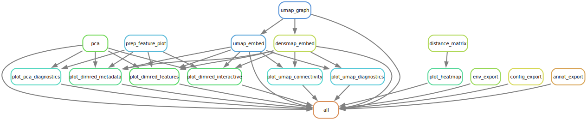

# Unsupervised Analysis Worfklow
A general purpose [Snakemake](https://snakemake.readthedocs.io/en/stable/) workflow to perform selected unsupervised analyses and visualizations of high-dimensional (normalized) data.

**If you use this workflow in a publication, don't forget to give credits to the authors by citing the URL of this (original) repository (and its DOI, see Zenodo badge above -> coming soon).**

Table of contents
----------------
  * [Authors](#authors)
  * [Software](#software)
  * [Methods](#methods)
  * [Features](#features)
  * [Usage](#usage)
  * [Configuration](#configuration)
  * [Examples](#examples)
  * [Links](#links)

# Authors
- [Stephan Reichl](https://github.com/sreichl)

# Software
This project wouldn't be possible without the following software and their dependencies

| Software       | Reference (DOI)                                   |
| :------------: | :-----------------------------------------------: |
| ComplexHeatmap | https://doi.org/10.1093/bioinformatics/btw313     |
| densMAP        | https://doi.org/10.1038/s41587-020-00801-7        |
| ggally         | https://CRAN.R-project.org/package=GGally         |
| ggplot2        | https://ggplot2.tidyverse.org/                    |
| ggrepel        | https://CRAN.R-project.org/package=ggrepel        |
| pandas         | https://doi.org/10.5281/zenodo.3509134            |
| patchwork      | https://CRAN.R-project.org/package=patchwork      |
| PCA            | https://doi.org/10.1080/14786440109462720         |
| plotly express | https://plot.ly                                   |
| scikit-learn   | http://jmlr.org/papers/v12/pedregosa11a.html      |
| Snakemake      | https://doi.org/10.12688/f1000research.29032.2    |
| umap-learn     | https://doi.org/10.21105/joss.00861               |

# Methods
This is a template for the Methods section of a scientific publication and is intended to serve as a starting point. Only retain paragraphs relevant to your analysis. References [ref] to the respective publications are curated in the software table above. Versions (ver) have to be read out from the respective conda environment specifications (.yaml file) or post execution. Parameters that have to be adapted depending on the data or workflow configurations are denoted in squared brackets e.g. [X].

The outlined analyses were performed using the programming languages R (ver) [ref] and Python (ver) [ref] unless stated otherwise. We applied both linear and non-linear unsupervised analysis methods for dimensionality reduction on normalized data for downstream analyses (e.g., clustering) and to visualize emerging patterns in lower dimensional embeddings.

**Principal Component Analysis (PCA)**
We used Principal Component Analysis (PCA) [ref] from scikit-learn (ver) [ref] as the linear approach. We visualized [n_components] principal components and kept [X/all] components for downstream analyses. For diagnostic purposes we visualized the variance explained of all and the top 10% of principal components (PCs) using elbow- and cumulative-variance-plots, sequential pair-wise PCs for up to 10 PCs using scatter-, and density-plots (colored by [metadata_of_interest]), and finally loadings plots showing the magnitude and direction of the 10 most influential features for each PC combination. The R packages ggally (ver) [ref] and ggrepel (ver) [ref] were used to improve the diagnostic visualizations.

**Uniform Manifold Approximation and Projection (UMAP)**
Uniform Manifold Approximation projection (UMAP) from umap-learn (ver) [ref] was used as the non-linear approach. The metric [metric] and number of neighbors [n_neighbors] were used for the generation of a shared k-nearest-neighbor graph. The graph was embedded in [n_components] dimensions with minimum distance parameter [min_dist].
(Optional) We used the density preserving regularization option, densMAP [ref], during the embedding step, with default parameters to account for varying local density of the data within its original high dimensional space.

**Hierarchically Clustered Heatmap**
Hierarchically clustered heatmaps of scaled data (z-score) were generated using the R package ComplexHeatmap (ver) [ref]. The distance metric [metric] and clustering method [clustering_method] were used to determine the hierarchical clustering of observations (rows) and features (columns), respectively. The heatmap was annotated with metadata [metadata_of_interest]. The values were colored by the top percentiles (0.01/0.99) of the data to avoid shifts in the coloring scheme caused by outliers.

**Visualization**
The R-packages ggplot2 (ver) [ref] and patchwork (ver) [ref] were used to generate all 2D visualizations colored by metadata [metadata] and/or feature(s) [features_to_plot].
Interactive visualizations in self-contained HTML files of all 2D and 3D projections and embeddings were generated using plotly express (ver) [ref].

**The analysis and visualizations described here were performed using a publicly available Snakemake [ver] (ref) workflow [ref - cite this workflow here].**

# Features
The workflow perfroms the following analyses on each dataset provided in the annotation file. A result folder "unsupervised_analysis" is generated containing a folder for each dataset.
- Principal Component Anlaysis (PCA) keeping all components (.pickle and .CSV)
  - diagnostics (.PNG):
      - variance: scree-plot and cumulative explained variance-plot of all and top 10% principal components
      - pairs: sequential pair-wise PCs for up to 10 PCs using scatter- and density-plots colored by metadata_of_interest
      - loadings: showing the magnitude and direction of the 10 most influential features for each PC combination
- Uniform Manifold Approximation & Projection (UMAP)
  - k-nearest-neighbor graph (.pickle): generated using the maximum n_neighorhood parameter together with the provided metrics
  - low dimensional embedding (.pickle and .CSV): using the precomputed-knn graph from before, embeddings are parametrized using min_dist and n_components
  - densMAP (optional): local density preserving regularization as additional dimensionality reduction method (i.e., all UMAP parameter combinations and downstream visualizations apply)
  - diagnostics (.PNG): 2D embedding colored by PCA coordinates, vector quantization coordinates, approximated local dimension, neighborhood Jaccard index
  - connectivity (.PNG): graph/network-connectivity plot with edge-bundling (hammer algorithm variant)
- Hierarchically Clustered Heatmap (.PNG)
    - hierarchically clustered heatmaps of scaled data (z-score) with configured distance metrics and clustering methods (all combinations are computed), and annotated with metadata_of_interest.
- Visualization
  -  2D metadata and feature plots (.PNG) of the first 2 principal components and all 2D embeddings, depending on the method
  -  interactive 2D and 3D visualizations (self contained HTML files) of all projections and embeddings (**not in the example results or report due to large sizes**)
- Results directories for each dataset have the following structure:
  -  "method" (containing all the data as .pickle and/or .CSV files)
    -  plots (for all visualizations as .PNG files)

# Usage
Here are some tips for the usage of this workflow:
- Start with minimal parameter combinations and without UMAP diagnostics and connectivity plots (computational expensive and slow)
- Heatmaps require **a lot** of memory, hence the memory allocation is solved dynamically. If nevertheless a out-of-memory exception occurs the flag `--retries 2` can be used to trigger automatic resubmission upon failure with twice (2x) the memory.

# Configuration
Detailed specifications can be found here [./config/README.md](./config/README.md)

# Examples
We provide a minimal example of the analysis of the [UCI ML hand-written digits datasets](https://archive.ics.uci.edu/ml/datasets/Optical+Recognition+of+Handwritten+Digits) imported from [sklearn](https://scikit-learn.org/stable/modules/generated/sklearn.datasets.load_digits.html) in the [test folder](./.test/):
- config
    - project configuration: digits_unsupervised_analysis_config.yaml
    - sample annotation: digits_unsupervised_analysis_annotation.csv
- data
    - dataset: digits_data.csv
    - metadata: digits_labels.csv
- results
    - containing all results in a dataset oriented structure (without large interactive HTML or object files)
- detailed self-contained HTML [report](./.test/report.html) for distribution and reproducibility
- performance/speed: on a HPC it took less than 6.5 minutes to complete a full run (with up to 32GB of memory per task)

# Links
- [GitHub Repository](https://github.com/epigen/unsupervised_analysis/)
- [GitHub Page](https://epigen.github.io/unsupervised_analysis/)
- [Zenodo Repository (coming soon)]()
- [Snakemake Workflow Catalog Entry](https://snakemake.github.io/snakemake-workflow-catalog?usage=epigen/unsupervised_analysis)
